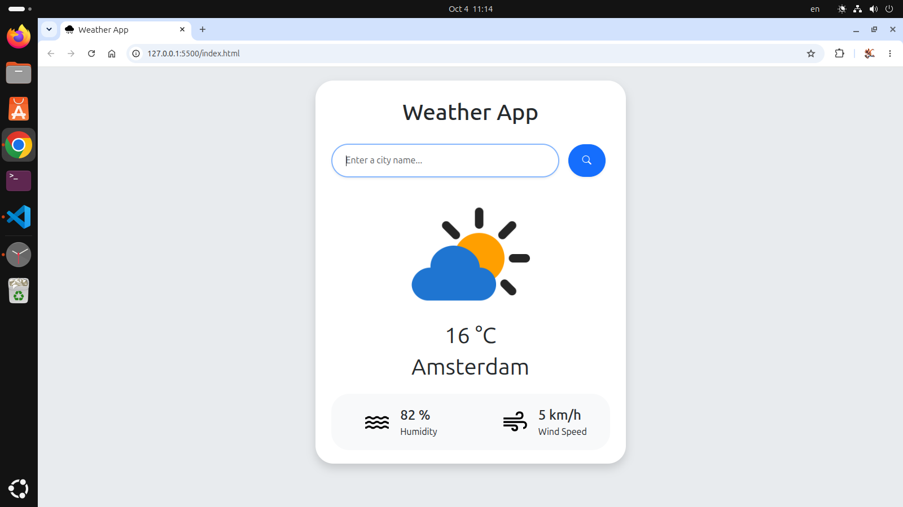
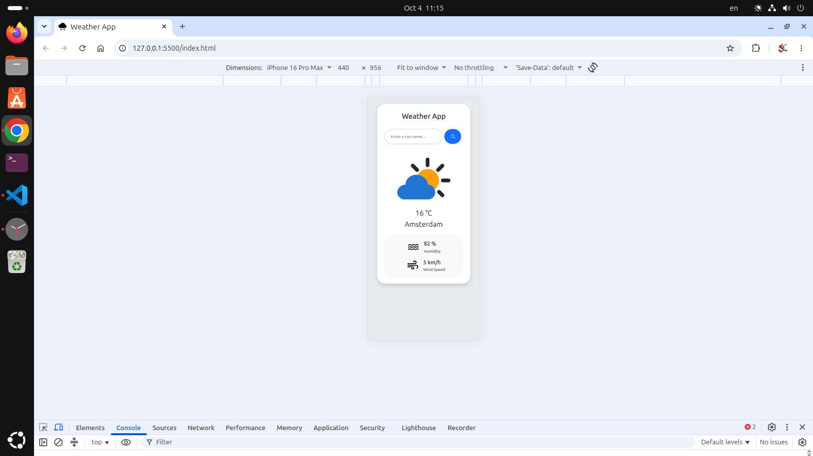

# Weather App 🌤️

## Description
A clean, responsive, and user-friendly Weather Application that allows users to search for any city worldwide and retrieve real-time weather conditions. It displays the current temperature, humidity level, and wind speed. The project is built using Vanilla JavaScript and Bootstrap 5, utilizing the Open-Meteo API to fetch accurate geographical and meteorological data asynchronously.

## Screenshot



## Live Demo
🌍 [Click here to see the Live Demo](https://mahanahmadnia.github.io/Weather-App/) 

## Features
- **Real-Time Data:** Accurate current temperature, humidity, and wind speed.
- **City Search:** Resolves city names into geographical coordinates automatically.
- **Responsive Design:** Fully mobile-friendly UI using Bootstrap 5 grid system.
- **Smart Search:** Supports both clicking the search button and pressing the `Enter` key.
- **Error Handling:** Graceful alerts for invalid city names or network issues.
- **Dynamic UI:** Shows "Searching..." status while data is being fetched.

## Technology
- **HTML5:** Semantic structure and SEO meta tags.
- **Bootstrap 5:** Styling, layout, UI components, and responsive design.
- **JavaScript (ES6+):** DOM manipulation, Event Listeners, and Asynchronous programming (`fetch`, `Promises`).
- **APIs:** 
  - [Open-Meteo Geocoding API](https://open-meteo.com/en/docs/geocoding-api)
  - [Open-Meteo Forecast API](https://open-meteo.com/en/docs)

## Project Structure

```text
weather-app/
│
├── index.html                           # Main HTML layout
├── script.js                            # JavaScript logic and API calls
├── README.md                            # Project documentation and details
└── images/                              # Directory for assets
    ├── 7133364.png                      # Main weather illustration
    ├── water_36dp_..._GRAD0_opsz40.svg  # Humidity icon
    ├── air_36dp_..._GRAD0_opsz40.svg    # Wind speed icon
    ├── cloud-rain-fill.svg              # Website favicon
    ├── 2026-10-04_11-15.png             # Desktop screenshot
    └── 2026-10-04_11-15_1.png           # Mobile screenshot 
```

## Author

**MahanAhmadnia**

## License

This project is licensed under the MIT License.